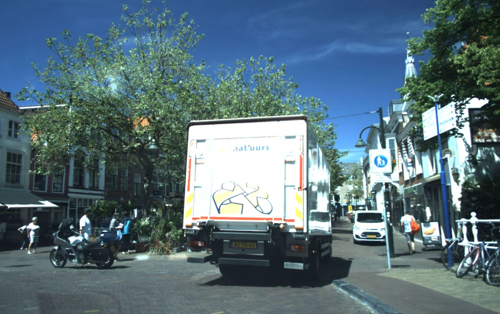
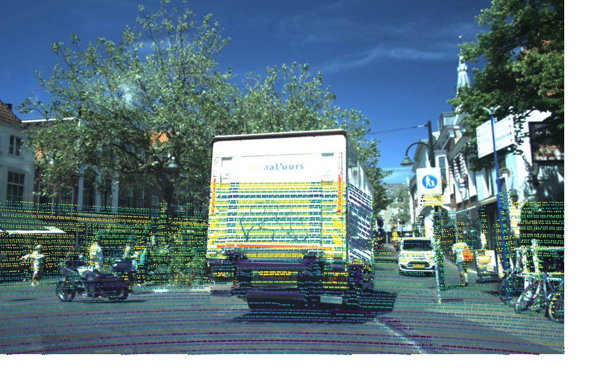

## 📊 示例效果

<p float="left">
  
  
</p>


# VOD_Ve2Cam
Convert lidar data from the View-of-Delft dataset to the camera coordinate system
这个项目演示了如何将 **View-of-Delft 数据集** 的 LiDAR/Radar 点云投影到相机图像上，并用强度信息给点着色。

## 功能
- 支持 `.bin` 格式点云读取（KITTI 格式：x, y, z, intensity）。
- 自动判断外参矩阵方向（T 或 T^-1）。
- 将点云投影到相机图像，并保存带 overlay 的结果。
- 颜色按照强度映射（colormap 可选），点大小与深度相关。

## 使用方法
1. 准备数据：
   - 图像：`your_address`
   - 点云：`your_address`
  
## 🔧 安装依赖

建议使用 Python 3.10–3.12。  
可以直接安装 `requirements.txt` 里的依赖。


```bash
pip install -r requirements.txt

